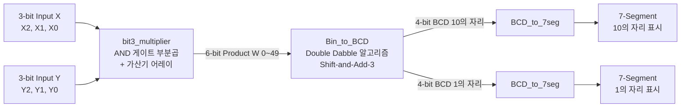

# 3-bit 구조적 곱셈기 및 7-Segment 표시 시스템 (Final Exam - Term Project)


기본 논리 게이트 프리미티브(`and`, `or`, `xor`, `not`)와 전가산기/반가산기 어레이(Adder Array)만을 조합하여, 산술 연산자(`*`, `+` 등) 및 이동 연산자(`<<`, `>>`) 사용을 배제한 **제약 조건 준수 3비트 구조적 곱셈기(3-bit Structural Multiplier)** 및 **7세그먼트 2자리 10진수(BCD) 디스플레이 연동 시스템**을 설계한 텀프로젝트입니다.

---

## 📌 주요 링크 및 보고서

- 📑 **텀프로젝트 최종 보고서 (PDF)**: [`2022142046_최다빈_텀프로젝트결과보고서.pdf`](2022142046_최다빈_텀프로젝트결과보고서.pdf)

---

## 🛠️ 개발 및 설계 환경

| 항목 | 상세 사양 |
| :--- | :--- |
| **과목명** | 디지털회로설계 (Digital Circuit Design) |
| **타겟 보드** | Terasic DE10-Lite (Intel MAX 10 FPGA) / DE1-SoC |
| **EDA 툴** | Intel Quartus Prime 20.1 Lite Edition |
| **하드웨어 기술 언어** | Verilog HDL (Gate-level & Structural Modeling) |
| **입출력 장치** | 6개 슬라이드 스위치 (3-bit X, 3-bit Y), 2개 7-Segment (10의 자리, 1의 자리) |

---

## 🏛️ 시스템 아키텍처

본 시스템은 추상화된 동작적 모델링을 배제하고 순수 구조적 모델링으로 구현되었습니다.



---

## ⚡ 핵심 설계 제약 조건 및 구현 원리

1. **산술 및 이동 연산자 사용 전면 배제**:
   - 코딩 시 `+`, `-`, `*`, `/`, `%` 및 `<<`, `>>` 연산자를 일절 사용하지 않고, 오직 하드웨어 게이트 수준으로 설계
2. **게이트 레벨 곱셈기 (`bit3_multiplier.v`)**:
   - $1 \times 1 = 1$ 특성을 갖는 `and` 게이트 9개로 부분곱(Partial Products) 생성
   - 반가산기(`HA.v`) 및 전가산기(`FA.v`)를 다단으로 연결한 가산기 어레이(Adder Array)를 구성하여 6비트 곱셈 결과 $W[5:0]$ 도출 ($0 \times 0 = 0 \sim 7 \times 7 = 49$)
3. **Double Dabble 기반 이진수-BCD 변환 (`Bin_to_BCD.v`, `Add3.v`)**:
   - 6비트 곱셈 결과를 10진수 2자리로 분리하기 위해 Shift-and-Add-3 네트워크 파이프라인 구성
   - 5 이상인 경우 +3을 보정하는 논리를 카르노 맵 기반 SOP(Sum of Products) 순수 논리 게이트로 구현
4. **Active Low 7-Segment 구동 (`BCD_to_7seg.v`, `seg_out.v`)**:
   - BCD 신호를 7세그먼트 LED 패턴으로 변환 후, 보드 하드웨어 특성에 맞춰 Active Low로 출력

---

## 📂 프로젝트 파일 구조

```
class/digital_circuit_design/Final_Exam/
├── rtl/
│   ├── top_bin_to_7Seg_out.v           # 최상위 데이터패스 통합 모듈
│   ├── bit3_multiplier.v               # 3비트 구조적 곱셈기 (Adder Array)
│   ├── Bin_to_BCD.v                    # 6-bit 이진수 -> 2자리 BCD 변환기
│   ├── Add3.v                          # Double-Dabble +3 보정 셀
│   ├── BCD_to_7seg.v                   # BCD -> 7-Segment 디코더
│   ├── seg_out.v                       # 7-Segment 출력 드라이버
│   ├── HA.v                            # 반가산기 (Primitive gate level)
│   └── FA.v                            # 전가산기 (Primitive gate level)
├── 2022142046_최다빈_텀프로젝트결과보고서.pdf  # 📑 텀프로젝트 최종 제출 보고서
└── README.md                           # 프로젝트 상세 기술 문서
```
