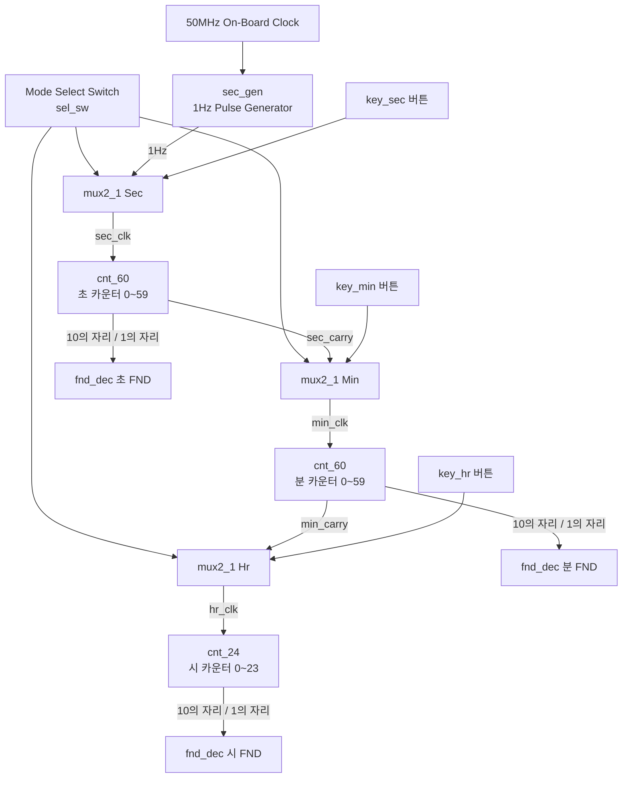

# FPGA 기반 디지털 시계 (Digital Watch) 설계 (Midterm Exam)


Intel / Altera Cyclone V FPGA 상에서 Verilog HDL을 사용하여 6개의 7-Segment(FND) 디스플레이를 통해 **시(24시간), 분(60분), 초(60초)**를 실시간으로 표시하고, 푸시버튼 입력을 통해 시간을 조정할 수 있는 **디지털 시계(Digital Watch) 시스템** 설계 프로젝트입니다.

---

## 🛠️ 개발 환경

| 항목 | 상세 사양 |
| :--- | :--- |
| **타겟 보드** | Intel Cyclone V SoC FPGA (DE1-SoC / DE10-Standard) |
| **EDA 툴** | Intel Quartus Prime 20.1 Lite Edition |
| **하드웨어 기술 언어** | Verilog HDL |
| **디스플레이** | 6-Digit 7-Segment Display (HH:MM:SS) |
| **시스템 주 클럭** | 50 MHz (PIN_AF14) |

---

## 🏛️ 시스템 아키텍처

50MHz 온보드 클럭을 분주하여 1초 신호를 생성하고, 60진/24진 카운터를 순차적으로 캐리(Carry) 연결하여 시계 기능을 구현합니다. 또한 2:1 멀티플렉서를 통해 일반 시계 모드와 시간 수정 모드를 선택할 수 있습니다.



---

## ⚙️ 주요 모듈별 기능 설명

1. **`Digital_watch.v` (Top Module)**:
   - 전체 서브모듈을 인스턴스화하고 신호 배선을 총괄하는 최상위 모듈
2. **`sec_gen.v` (1초 펄스 생성기)**:
   - 50MHz 클럭 기준으로 25,000,000 클럭마다 신호를 토글하여 정확한 1초 주기의 펄스를 생성
3. **`mux2_1.v` (2:1 Multiplexer)**:
   - `sel_sw` 상태에 따라 일반 1초 카운트 신호 또는 사용자의 버튼 입력(`key_sec`, `key_min`, `key_hr`)을 클럭 소스로 선택
4. **`cnt_60.v` (60진 카운터 - 초/분)**:
   - 0부터 59까지 카운트하며, 59 도달 시 10의 자리와 1의 자리를 0으로 리셋하고 상위 카운터로 자리올림(Carry) 신호 전달
5. **`cnt_24.v` (24진 카운터 - 시)**:
   - 0부터 23까지 카운트하여 24시간 형식의 시간 값을 10의 자리와 1의 자리로 분리 출력
6. **`fnd_dec.v` (7-Segment Decoder)**:
   - 4비트 BCD 숫자 데이터(0~9)를 7세그먼트 FND 패턴(Active Low)으로 변환
7. **`clock_divider.v` (클럭 분주기)**:
   - 클럭 분주 기능 모듈

---

## 🔌 핀 배치 (Pin Assignments - Cyclone V)

| 포트명 | 방향 | Cyclone V 핀 번호 | 신호 설명 |
| :--- | :---: | :---: | :--- |
| `clk` | In | `PIN_AF14` | 50MHz 온보드 클럭 |
| `nRst` | In | `PIN_AJ4` | 시스템 리셋 버튼 (Active-Low) |
| `sel_sw` | In | `PIN_AB30` | 시계 동작 / 시간 설정 모드 전환 스위치 |
| `key_sec` | In | `PIN_AK4` | 초 수동 증가 푸시버튼 |
| `key_min` | In | `PIN_AA14` | 분 수동 증가 푸시버튼 |
| `key_hr` | In | `PIN_AA15` | 시 수동 증가 푸시버튼 |
| `fnd_sec_one[6:0]` | Out | `W17` ~ `AH18` | 초 1의 자리 7-Segment (HEX0) |
| `fnd_sec_ten[6:0]` | Out | `AF16` ~ `V17` | 초 10의 자리 7-Segment (HEX1) |
| `fnd_min_one[6:0]` | Out | `AA21` ~ `W16` | 분 1의 자리 7-Segment (HEX2) |
| `fnd_min_ten[6:0]` | Out | `Y19` ~ `AD20` | 분 10의 자리 7-Segment (HEX3) |
| `fnd_hr_one[6:0]` | Out | `AD21` ~ `AH22` | 시 1의 자리 7-Segment (HEX4) |
| `fnd_hr_ten[6:0]` | Out | `AF21` ~ `AB21` | 시 10의 자리 7-Segment (HEX5) |

---

## 📂 프로젝트 파일 구조

```
class/digital_circuit_design/Midterm_Exam/
├── rtl/
│   ├── Digital_watch.v                 # 디지털 시계 최상위 통합 모듈
│   ├── clock_divider.v                 # 클럭 분주기 모듈
│   ├── cnt_24.v                        # 24진 시간 카운터
│   ├── cnt_60.v                        # 60진 분/초 카운터
│   ├── fnd_dec.v                       # 7-Segment 디코더 모듈
│   ├── mux2_1.v                        # 2:1 멀티플렉서 모듈
│   └── sec_gen.v                       # 1초 기준 신호 생성기
├── constraints/
│   └── cnt_60.qsf                      # Quartus Prime 핀 배치 설정 파일
└── README.md                           # 프로젝트 상세 기술 문서
```
