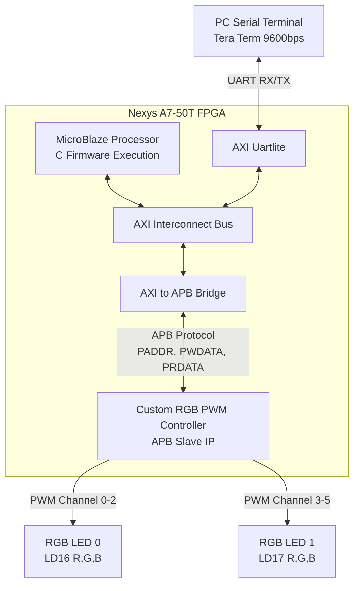

# APB 기반 RGB LED 제어 시스템 (APB-based RGB LED Controller)


AMBA APB(Advanced Peripheral Bus) 인터페이스 기반의 **커스텀 RGB PWM 컨트롤러(APB Slave IP)**를 Verilog HDL로 직접 설계하고, Xilinx **MicroBlaze 프로세서 시스템**에 통합한 임베디드 하드웨어/소프트웨어 프로젝트입니다.

PC 터미널(UART)에서 RGB 색상 값(0~255)을 입력받아 FPGA 보드 상의 **RGB LED 2개 (총 6개 PWM 채널)**를 독립적으로 256단계 정밀 제어합니다.

---

## 📌 주요 링크

- 🎥 **YouTube 시연 영상 (Shorts)**: [시연 영상 바로가기](https://youtube.com/shorts/Qn91vLUIbvw)
- 📖 **Notion 상세 프로젝트 보고서**: [디지털 시스템 설계 노션 페이지](https://safe-fiber-e17.notion.site/APB-RGB-LED-4cc45fa1068a4a7588f36212641a8207?source=copy_link)

---

## 🛠️ 개발 환경

| 항목 | 상세 사양 |
| :--- | :--- |
| **타겟 보드** | Digilent Nexys A7-50T (Xilinx Artix-7 `xc7s50csg324-1`) |
| **하드웨어 설계 (EDA)** | Vivado Design Suite 2023.1 (Verilog HDL) |
| **소프트웨어 개발 (IDE)** | Vitis Unified Software Platform 2023.1 (Baremetal C) |
| **시리얼 터미널** | Tera Term / Serial Monitor (9600 bps, 8-N-1) |
| **시스템 주 클럭** | 100 MHz (On-board Oscillator) |

---

## 🏛️ 시스템 아키텍처

본 시스템은 MicroBlaze 프로세서를 중심으로 AXI 버스와 APB 버스가 브릿지를 통해 연동되는 구조입니다.



### 주요 구성 요소
1. **MicroBlaze Processor**: UART 입력을 파싱하고 APB 주소 공간에 매핑된 레지스터에 읽기/쓰기를 수행하는 주 제어 유닛
2. **AXI to APB Bridge**: AXI 마스터(MicroBlaze)의 트랜잭션을 저전력/저복잡도 주변장치용 APB 슬레이브 프로토콜로 변환
3. **AXI Uartlite**: PC 터미널과의 9600bps 시리얼 통신 인터페이스
4. **Custom RGB PWM Controller (APB Slave IP)**:
   - APB 레지스터 파일 (6개 채널 각 8비트)
   - 100MHz 클럭 기반 1ms 주기(1kHz) 카운터
   - 6채널 PWM 신호 생성 로직

---

## 📋 메모리 및 레지스터 맵

AXI-to-APB Bridge를 통해 할당된 베이스 주소(`XPAR_APB_M_0_BASEADDR`)를 기준으로 각 채널별 8-bit 밝기 레지스터가 32-bit 정렬(4바이트 간격)로 배치되어 있습니다.

| Offset | 레지스터 이름 | 비트 폭 | 접근 권한 | 설명 |
| :---: | :--- | :---: | :---: | :--- |
| `0x00` | `ADDR_LED0_R_DUTY` | [7:0] | R/W | LED 0 Red 채널 Duty Cycle (0~255) |
| `0x04` | `ADDR_LED0_G_DUTY` | [7:0] | R/W | LED 0 Green 채널 Duty Cycle (0~255) |
| `0x08` | `ADDR_LED0_B_DUTY` | [7:0] | R/W | LED 0 Blue 채널 Duty Cycle (0~255) |
| `0x0C` | `ADDR_LED1_R_DUTY` | [7:0] | R/W | LED 1 Red 채널 Duty Cycle (0~255) |
| `0x10` | `ADDR_LED1_G_DUTY` | [7:0] | R/W | LED 1 Green 채널 Duty Cycle (0~255) |
| `0x14` | `ADDR_LED1_B_DUTY` | [7:0] | R/W | LED 1 Blue 채널 Duty Cycle (0~255) |

---

## ⚡ 하드웨어 설계 핵심 구현 (RTL)

### 1. APB 버스 슬레이브 인터페이스
- **쓰기 동작**: `w_apb_write_en = PSEL & PENABLE & PWRITE` 활성화 시, 주소 비트 `PADDR[4:2]`를 디코딩하여 `PWDATA[7:0]` 값을 대상 채널 레지스터에 동기화하여 저장
- **읽기 동작**: 조합 논리 MUX를 통해 `PADDR[4:2]`에 대응하는 레지스터 값을 `PRDATA[31:0]`로 즉시 출력
- **응답 신호**: 단순 1사이클 응답 구조로 `PREADY`는 1'b1, `PSLVERR`는 1'b0으로 유지

### 2. 1kHz PWM 신호 생성 로직
- 사람 눈의 잔상 효과를 고려하여 깜빡임이 인지되지 않는 1kHz(주기 1ms) 주파수 채택
- 100MHz 시스템 클럭 기준, 1ms 주기는 100,000 클럭 사이클 소요:
  - $\text{PWM Period} = 100\text{ MHz} \times 1\text{ ms} = 100,000\text{ cycles}$
- 17비트 카운터(`pwm_period_counter`, $0 \sim 99,999$) 구현
- 8비트 입력 값($0 \sim 255$)을 100,000 클럭 스케일에 맞추기 위해 스케일링 팩터 391을 곱하여 비교값(`w_scaled_duty`) 계산:
  - $\text{Scaling Factor} \approx \frac{100,000}{256} \approx 390.625 \rightarrow 391$
- 실시간 비교를 통한 High/Low 출력 생성:
  ```verilog
  assign o_pwm_ch[i] = (r_duty_reg[i] == 8'hFF) ? 1'b1 :
                       (r_duty_reg[i] == 8'h00) ? 1'b0 :
                       (pwm_period_counter < w_scaled_duty);
  ```

---

## 💻 소프트웨어 및 명령어 체계 (Firmware)

Vitis 2023.1 환경에서 MicroBlaze를 구동하는 C 베어메탈 펌웨어로 작성되었습니다. `Xil_In32()`와 `Xil_Out32()` 저수준 I/O 매크로를 사용하여 APB 레지스터 공간에 직접 접근합니다.

### 명령어 프로토콜

| 구분 | 명령어 포맷 | 예시 | 설명 및 터미널 응답 |
| :--- | :--- | :--- | :--- |
| **색상 제어** | `<LED#> <R> <G> <B>` | `0 255 128 0` | LED 0을 R=255, G=128, B=0으로 설정<br/>`OK: LED 0 set to R:255, G:128, B:0` |
| **상태 조회** | `<LED#>` | `0` | LED 0의 현재 레지스터 값 읽기<br/>`RGB 0 : R-255, G-128, B-0` |

---

## 🔌 핀 배치 (Nexys A7 FPGA Constraints)

| 포트명 | 방향 | Nexys A7 핀 번호 | 신호 설명 |
| :--- | :---: | :---: | :--- |
| `i_clk_100mhz` | In | `E3` | 100MHz 시스템 온보드 클럭 |
| `i_resetn` | In | `C12` | CPU 리셋 푸시버튼 (Active-Low) |
| `i_uart_rxd` | In | `C4` | USB-UART 수신선 (FPGA <- PC) |
| `o_uart_txd` | Out | `D4` | USB-UART 송신선 (FPGA -> PC) |
| `o_rgb_pwm[0]` | Out | `N15` | LED0 Red (LD16) |
| `o_rgb_pwm[1]` | Out | `M16` | LED0 Green (LD16) |
| `o_rgb_pwm[2]` | Out | `R12` | LED0 Blue (LD16) |
| `o_rgb_pwm[3]` | Out | `N16` | LED1 Red (LD17) |
| `o_rgb_pwm[4]` | Out | `R11` | LED1 Green (LD17) |
| `o_rgb_pwm[5]` | Out | `G14` | LED1 Blue (LD17) |

---

## 📂 프로젝트 파일 구조

```
class/digital_system_architecture/Final_Exam/
├── rtl/
│   ├── system_top.v            # 최상위 래퍼 (BD Wrapper와 PWM Controller 연결)
│   ├── rgb_pwm_controller.v    # 6채널 APB Slave RGB PWM 컨트롤러 IP
│   └── apb_rgb_led.v           # APB RGB LED 모듈
├── constraints/
│   └── constr.xdc              # Nexys A7 핀 맵핑 및 클럭 제약 조건
├── software/
│   └── main.c                  # MicroBlaze용 Vitis Baremetal C 펌웨어
└── README.md                   # 프로젝트 소개 및 기술 문서
```

---

## 💡 고찰 및 향후 개선 과제

1. **PWM 듀티 스케일링 정확도 향상**:
   - 현재 구현은 근사 곱셈 계수 `391`을 사용하여 $255 \times 391 = 99,705$로 최대 듀티가 약 99.7%에 머무르는 미세 오차가 존재합니다.
   - **개선 방안**: DDA(Digital Differential Analyzer) 누산기 알고리즘을 적용하여 덧셈기 기반으로 오차 없는 선형 출력을 구성하거나, 비트 폭을 확장한 정확한 나눗셈기를 활용할 수 있습니다.
2. **APB 버스 핸드셰이크 정밀화**:
   - 현재 슬레이브 모듈은 `PREADY = 1'b1`로 고정되어 1클럭 내 처리를 가정하고 있습니다.
   - **개선 방안**: FSM(유한 상태 머신) 기반의 버스 인터페이스를 구축하여 다중 사이클 접근 및 예외 처리(`PSLVERR`)를 유연하게 지원하도록 확장할 수 있습니다.
