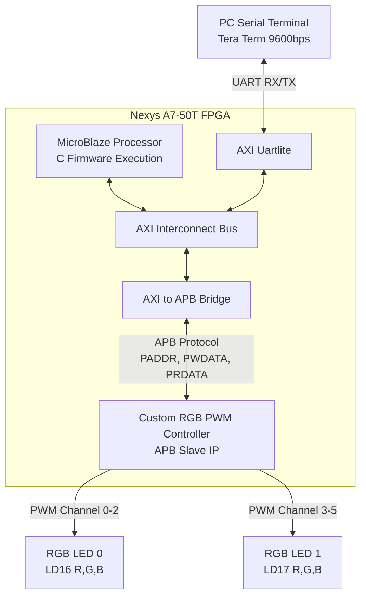

# 디지털 시스템 설계 기말과제 보고서 (Final Exam Report)

| 항목 | 내용 |
| :--- | :--- |
| **과목명** | 디지털 시스템 설계 (Digital System Design) |
| **과제명** | **APB 기반 RGB LED 제어 시스템** |
| **담당교수** | 전자공학부 이진 교수님 |
| **제출자** | 전자공학부 최다빈 (학번: 2022142046) |
| **제출일** | 2025. 06. 20 |

---

## 📌 주요 링크

- 🎥 **YouTube 시연 영상**: [시연 영상 바로가기 (Shorts)](https://youtube.com/shorts/Qn91vLUIbvw)
- 📖 **Notion 상세 프로젝트 보고서**: [디지털 시스템 설계 노션 페이지](https://safe-fiber-e17.notion.site/APB-RGB-LED-4cc45fa1068a4a7588f36212641a8207?source=copy_link)
- 📁 **소스 코드 및 제약조건**:
  - RTL: [`rtl/system_top.v`](rtl/system_top.v), [`rtl/rgb_pwm_controller.v`](rtl/rgb_pwm_controller.v), [`rtl/apb_rgb_led.v`](rtl/apb_rgb_led.v)
  - Constraints: [`constraints/constr.xdc`](constraints/constr.xdc)
  - Software: [`software/main.c`](software/main.c)

---

## 1. 프로젝트 목표

본 프로젝트의 목표는 **AMBA APB(Advanced Peripheral Bus)** 인터페이스 규격을 준수하는 PWM(Pulse Width Modulation) 기반의 RGB LED 컨트롤러를 Verilog HDL로 직접 설계하고, 이를 **MicroBlaze 임베디드 프로세서 시스템**에 통합하는 것입니다.

최종적으로 PC의 UART 시리얼 터미널을 통해 제어 명령어를 입력받아 보드 상의 2개 RGB LED(총 6개 채널: LED0 R/G/B, LED1 R/G/B)를 독립적으로 제어합니다. 각 채널은 0~255(256단계) 세기 조절이 가능하여 다채로운 색상 조합을 표현할 수 있습니다.

---

## 2. 개발 환경

- **타겟 보드**: Digilent Nexys A7-50T (Xilinx Artix-7 `xc7s50csg324-1`)
- **하드웨어 설계 (EDA)**: Vivado Design Suite 2023.1
- **소프트웨어 개발 (IDE)**: Vitis Unified Software Platform 2023.1
- **하드웨어 기술 언어**: Verilog HDL
- **소프트웨어 언어**: Baremetal C
- **시리얼 통신 환경**: Tera Term (9600 bps, 8-N-1)

---

## 3. 시스템 구성

### 3-1. 전체 시스템 블록도

하드웨어 시스템은 MicroBlaze 프로세서를 중심으로 고속 버스인 AXI와 주변장치 버스인 APB가 공존하는 구조입니다.

- **MicroBlaze Processor**: 시스템의 주 제어 유닛으로, C 펌웨어 코드를 실행하며 UART 통신 및 메모리 맵 기반 주변 장치를 제어합니다.
- **AXI Interconnect**: 프로세서와 AXI 주변장치 간의 고속 인터커넥트 버스입니다.
- **AXI to APB Bridge**: AXI 버스에 연결된 MicroBlaze가 APB 기반 저속 주변장치와 통신할 수 있도록 프로토콜을 변환해 주는 브릿지 IP입니다.
- **AXI Uartlite**: PC 터미널과의 UART 시리얼 통신을 담당합니다.
- **Custom RGB Controller (APB Slave)**: 2개의 RGB LED를 제어하기 위한 6개 PWM 채널을 포함하며, APB Slave 인터페이스를 통해 제어받는 직접 설계한 커스텀 IP입니다.

---

### 3-2. 주소 맵 (Address Map) 및 레지스터 사양

MicroBlaze가 APB 브릿지를 통해 접근하는 메모리 공간 내에 커스텀 RGB 컨트롤러가 매핑되어 있습니다.

- **Base Address**: `XPAR_APB_M_0_BASEADDR`

| Offset | 레지스터 이름 | 비트 폭 | 접근 권한 | 설명 |
| :---: | :--- | :---: | :---: | :--- |
| `0x00` | `ADDR_LED0_R_DUTY` | [7:0] | R/W | LED 0 Red 채널 Duty Cycle (0~255) |
| `0x04` | `ADDR_LED0_G_DUTY` | [7:0] | R/W | LED 0 Green 채널 Duty Cycle (0~255) |
| `0x08` | `ADDR_LED0_B_DUTY` | [7:0] | R/W | LED 0 Blue 채널 Duty Cycle (0~255) |
| `0x0C` | `ADDR_LED1_R_DUTY` | [7:0] | R/W | LED 1 Red 채널 Duty Cycle (0~255) |
| `0x10` | `ADDR_LED1_G_DUTY` | [7:0] | R/W | LED 1 Green 채널 Duty Cycle (0~255) |
| `0x14` | `ADDR_LED1_B_DUTY` | [7:0] | R/W | LED 1 Blue 채널 Duty Cycle (0~255) |

---

### 3-3. PWM 생성 로직 및 하드웨어 구현

#### APB 버스 트랜잭션 처리
- **쓰기 동작**: `PSEL`, `PENABLE`, `PWRITE` 신호가 모두 High일 때 쓰기 트랜잭션으로 인식합니다. 4바이트 정렬을 고려하여 `PADDR[4:2]`를 디코딩하고, `PWDATA[7:0]`에 실려온 데이터를 대상 레지스터(`r_duty_reg[i]`)에 저장합니다.
- **읽기 동작**: `PSEL`과 `PENABLE`이 High이고 `PWRITE`가 Low일 때 읽기 트랜잭션으로 처리합니다. `PADDR[4:2]`에 대응하는 레지스터 값을 `PRDATA` 버스로 출력합니다.
- **대기 신호**: 단일 사이클 접근으로 처리하기 위해 `PREADY`는 1'b1, `PSLVERR`는 1'b0으로 설정했습니다.

#### 1kHz 기준 타이머 및 비교 로직
- 사람 눈의 깜빡임 인지 한계(약 300Hz)를 넘어서는 **1kHz (주기 1ms)**를 PWM 기본 주파수로 선정했습니다.
- 100MHz 시스템 클럭 기준, 1ms는 100,000 클럭 사이클입니다.
  $$100\,\text{MHz} \times 1\,\text{ms} = 100,000\,\text{클럭}$$
- 0부터 99,999까지 카운트하는 17비트 카운터(`pwm_period_counter`)를 구현했습니다.
- 8비트 밝기 값(0~255)을 100,000 클럭 주기에 매핑하기 위해 스케일링 팩터 391($100000 / 256 \approx 390.625$)을 곱하여 스케일링된 듀티 값(`w_scaled_duty`)을 산출합니다.
- 카운터와 스케일링 듀티 값을 실시간 비교하여 PWM 신호를 출력합니다:
  - `duty == 255`: 상시 High (1'b1)
  - `duty == 0`: 상시 Low (1'b0)
  - 그 외: `pwm_period_counter < w_scaled_duty` 비교 결과 출력

---

## 4. 소프트웨어 구조 및 명령어 프로토콜

MicroBlaze 상에서 실행되는 Vitis C 프로그램은 Xilinx 저수준 I/O 함수인 `Xil_Out32()`와 `Xil_In32()`를 호출하여 APB 레지스터를 직접 제어합니다.

### 지원 명령어

1. **색상 설정 (Set Color)**
   - 포맷: `<LED 번호(0~1)> <R(0~255)> <G(0~255)> <B(0~255)>`
   - 예시: `0 255 100 50` 입력 시 LED 0의 Red=255, Green=100, Blue=50 설정
   - 응답: `OK: LED 0 set to R:255, G:100, B:50`
2. **현재 상태 조회 (Get Status)**
   - 포맷: `<LED 번호(0~1)>`
   - 예시: `0` 입력 시 LED 0의 하드웨어 레지스터 값을 읽어 출력
   - 응답: `RGB 0 : R-255, G-100, B-50`

---

## 5. 핀 배치 (Nexys A7-50T Constraints)

| 신호명 | 방향 | FPGA 핀 번호 | 연결 기능 |
| :--- | :---: | :---: | :--- |
| `i_clk_100mhz` | Input | `E3` | 100MHz 시스템 클럭 |
| `i_resetn` | Input | `C12` | CPU 리셋 버튼 (Active-Low) |
| `i_uart_rxd` | Input | `C4` | USB-UART 수신 (PC -> FPGA) |
| `o_uart_txd` | Output | `D4` | USB-UART 송신 (FPGA -> PC) |
| `o_rgb_pwm[0]` | Output | `N15` | LED0 Red (LD16 Red) |
| `o_rgb_pwm[1]` | Output | `M16` | LED0 Green (LD16 Green) |
| `o_rgb_pwm[2]` | Output | `R12` | LED0 Blue (LD16 Blue) |
| `o_rgb_pwm[3]` | Output | `N16` | LED1 Red (LD17 Red) |
| `o_rgb_pwm[4]` | Output | `R11` | LED1 Green (LD17 Green) |
| `o_rgb_pwm[5]` | Output | `G14` | LED1 Blue (LD17 Blue) |

---

## 6. 결론 및 고찰

### 배운 점 및 성과
- AMBA 표준 버스 프로토콜 중 하나인 APB의 신호 타이밍과 트랜잭션 규격을 깊이 이해하고, 실제 Verilog HDL로 APB Slave IP를 설계하여 프로세서 시스템에 통합하는 전체 SoC 설계 흐름을 체득했습니다.
- C 언어 기반의 드라이버 펌웨어에서 `Xil_Out32`/`Xil_In32`를 통해 메모리 맵 I/O에 직접 접근함으로써 하드웨어와 소프트웨어의 긴밀한 상호작용 원리를 명확히 이해했습니다.

### 개선 과제 및 향후 발전 방향
1. **PWM 정밀도 개선**:
   - 곱셈 계수 근사값(391) 사용으로 인해 최대 듀티 사이클 시 약 99.7%에 머무르는 오차가 존재합니다.
   - DDA(Digital Differential Analyzer) 원리를 적용하여 덧셈 누산기 오버플로우 기반으로 토글하는 방식으로 개선하면 곱셈기 없이 완벽한 선형 제어가 가능합니다.
2. **APB 버스 인터페이스 안정성 확장**:
   - 현재는 `PREADY`가 항상 High로 고정되어 단일 사이클 처리를 가정하지만, 추후 내부 로직이 복잡해질 경우 FSM(상태 머신)을 도입하여 멀티 사이클 지연 응답 및 `PSLVERR` 예외 처리를 지원하도록 고도화할 수 있습니다.
