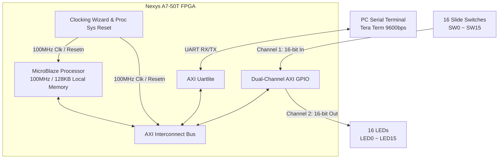

# MicroBlaze 기반 스위치 및 UART LED 제어 시스템 (Midterm Exam)


Xilinx FPGA 개발 보드 상에 **MicroBlaze 32비트 RISC 프로세서 시스템**을 구축하고, 듀얼 채널 AXI GPIO와 AXI Uartlite를 활용하여 16개의 슬라이드 스위치와 16개의 LED를 2가지 모드로 제어하는 임베디드 SoC 프로젝트입니다.

---

## 📌 주요 링크 및 문서

- 🎥 **YouTube 시연 영상 (Shorts)**: [시연 영상 바로가기](https://youtube.com/shorts/h1qh6ZmzPVs)
- 📑 **중간과제 상세 보고서 (PDF)**: [`디지털 시스템 설계 중간보고서.pdf`](디지털%20시스템%20설계%20중간보고서.pdf)

---

## 🛠️ 개발 환경

| 항목 | 상세 사양 |
| :--- | :--- |
| **타겟 보드** | Digilent Nexys A7-50T (Xilinx Artix-7 `xc7s50csg324-1`) |
| **하드웨어 설계** | Vivado Design Suite 2023.1 (IP Integrator, Block Design) |
| **소프트웨어 개발** | Vitis Unified Software Platform 2023.1 (Standalone Baremetal C) |
| **통신 환경** | Tera Term (9600 bps, 8-N-1) |
| **프로세서 로컬 메모리** | 128 KB Local BRAM (100 MHz 클럭) |

---

## 🏛️ 시스템 아키텍처

MicroBlaze 프로세서를 중심으로 시스템 버스인 AXI4-Lite를 통해 주변장치들이 유기적으로 연결된 SoC 구조입니다.



### 주요 하드웨어 블록
1. **MicroBlaze Processor**: 100MHz 클럭, 128KB Local Memory 구성으로 전체 소프트웨어 로직을 수행
2. **Dual-Channel AXI GPIO**: 단일 IP에서 2개 채널을 활성화하여 리소스 효율 극대화
   - **Channel 1 (16-bit Input)**: 16개 슬라이드 스위치(`switches_16bits`) 상태 수신
   - **Channel 2 (16-bit Output)**: 16개 보드 LED(`leds_16bits`) 출력 구동
3. **AXI Uartlite**: 9600 bps 시리얼 통신을 통해 PC Tera Term과 명령어 및 상태 메시지 송수신

---

## ⚙️ 듀얼 동작 모드 (Operating Modes)

사용자는 보드 상의 **0번 스위치(SW0)**를 조작하여 두 가지 제어 모드를 실시간으로 전환할 수 있습니다.

| 모드 구분 | SW0 상태 | 동작 설명 |
| :--- | :---: | :--- |
| **스위치 직접 제어 모드**<br/>(Switch Control Mode) | `0` (OFF) | - **LED0은 항상 ON**으로 유지<br/>- **SW1 ~ SW15**의 물리적 입력 상태가 **LED1 ~ LED15**에 1:1로 실시간 반영<br/>- 스위치 상태 변경 시에만 GPIO 출력을 갱신하고 상태 메시지 출력 |
| **UART 원격 제어 모드**<br/>(UART Remote Mode) | `1` (ON) | - PC 시리얼 터미널(Tera Term)의 대화형 프롬프트를 통해 개별 LED를 제어<br/>1. `LED number(0~15) Enter`: 제어할 LED 번호 입력<br/>2. `LED 상태(1=켜기, 0=끄기) 입력하세요`: 점등(1) 또는 소등(0) 설정<br/>3. 입력된 값에 따라 보드의 해당 LED 상태를 즉시 반영 |

---

## 💡 주요 기술 과제 및 해결 (128KB 메모리 제약 최적화)

- **문제점**:
  - 프로젝트 사양상 MicroBlaze의 Local Memory 크기가 **128 KB**로 엄격히 제한되었습니다.
  - 초기 구현 시 `xil_printf()`, `stdio.h`(`sscanf`), `string.h`(`memset`, `strlen`) 등 C 표준 라이브러리 사용으로 인해 **코드 크기 초과(메모리 오버플로우/링크 에러)**가 발생했습니다.
- **해결 방안**:
  - 메모리 사용량이 큰 무거운 표준 라이브러리 함수 사용을 전면 배제
  - 필수 기능만 수행하는 초경량 자체 함수를 직접 구현하여 메모리 풋프린트를 대폭 절감:
    - `Uart_Send_String()`: 저수준 FIFO 레지스터를 직접 조작하는 경량 문자열 송신
    - `Minimal_Atoi()`: ASCII 숫자를 정수로 변환하는 초간단 변환 함수
    - `Minimal_Read_Line()`: 버퍼 오버플로우를 방지하는 UART 한 줄 입력 및 에코 함수
  - 결과적으로 **128KB 메모리 제약 조건 하에서 링크 에러 없이 완벽히 빌드 및 정상 동작**을 달성했습니다.

---

## 🔌 핀 배치 (Nexys A7 Constraints)

| 포트명 | 방향 | FPGA 핀 | 신호 설명 |
| :--- | :---: | :---: | :--- |
| `Clk` | In | `E3` | 100MHz 시스템 온보드 클럭 |
| `reset_rtl_0` | In | `C12` | CPU 리셋 푸시버튼 (Active-Low) |
| `uart_rtl_0_rxd` | In | `C4` | USB-UART 수신 (PC -> FPGA) |
| `uart_rtl_0_txd` | Out | `D4` | USB-UART 송신 (FPGA -> PC) |
| `gpio_rtl_0_tri_i[0~15]` | In | `J15` ~ `V10` | 16개 슬라이드 스위치 (SW0 ~ SW15) |
| `gpio_rtl_1_tri_o[0~15]` | Out | `H17` ~ `V11` | 16개 단색 LED (LED0 ~ LED15) |

---

## 📂 프로젝트 파일 구조

```
class/digital_system_architecture/Midterm_Exam/
├── bd/
│   ├── exam.bd                         # Vivado 블록 디자인 원본
│   ├── exam.bda                        # 블록 디자인 어드레스 맵
│   └── exam_wrapper.v                  # 블록 디자인 최상위 Verilog 래퍼
├── constraints/
│   └── exam.xdc                        # Nexys A7 핀 맵핑 및 클럭 제약 조건
├── software/
│   └── main.c                          # 128KB 최적화 Baremetal C 펌웨어
├── 디지털 시스템 설계 중간보고서.pdf   # 중간과제 제출 최종 보고서
└── README.md                           # 프로젝트 상세 기술 문서
```
