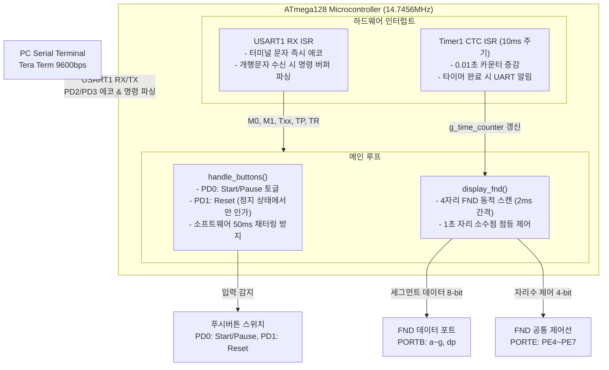
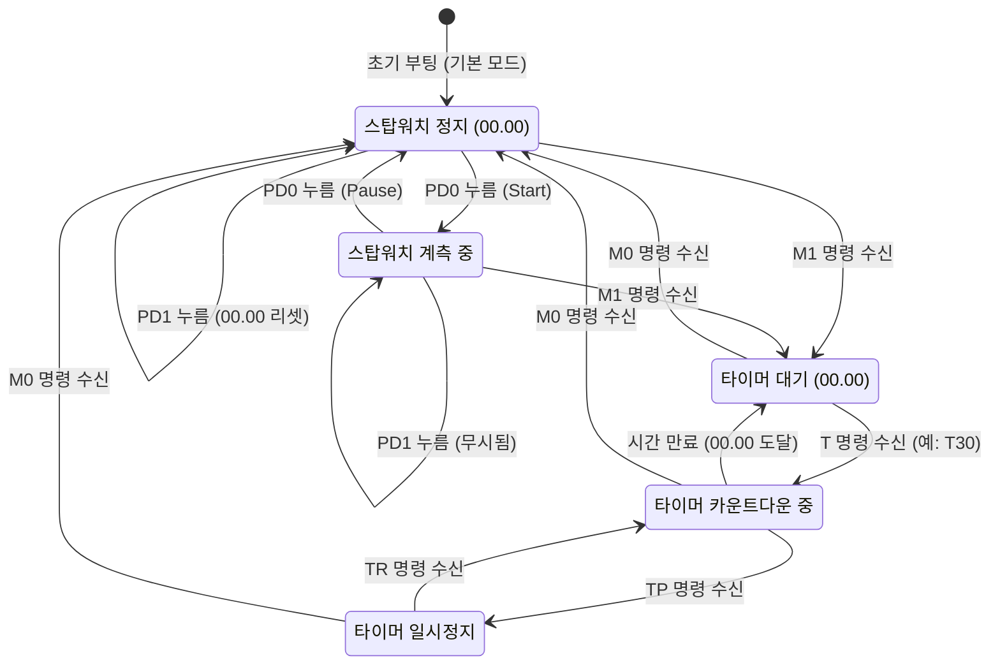

# ATmega128 기반 듀얼 모드 스탑워치 및 타이머 시스템 (Stopwatch & Timer System)


8비트 마이크로컨트롤러인 **Microchip/Atmel ATmega128**을 기반으로, 하드웨어 타이머/카운터 인터럽트 및 비동기 시리얼 통신(USART)을 결합하여 구현한 **0.01초 정밀도의 듀얼 모드(스탑워치 / 카운트다운 타이머) 제어 시스템**입니다.

PC 시리얼 터미널(Tera Term)과의 실시간 양방향 통신(명령 수신 및 문자 에코)과 외부 푸시버튼 입력을 통해 동작 모드 전환, 타이머 시간 설정(최대 99초), 일시정지 및 재개를 제어하며, 4자리 7-Segment(FND) 동적 디스플레이에 0.01초 단위(최대 99.99초)로 시간을 정밀하게 표시합니다.

---

## 📌 주요 문서 및 소스코드 바로가기

- 📑 **기말과제 결과보고서 (PDF)**: [`마이크로프로세서 기말보고서.pdf`](마이크로프로세서%20기말보고서.pdf)
- 📑 **요구사항 및 동작 검증 명세서**: [`▪스탑워치 타이머만들기.txt`](docs/▪스탑워치%20타이머만들기.txt)
- 💻 **펌웨어 C 소스코드**: [`final.c`](src/final.c)

---

## 🛠️ 개발 및 시스템 환경

| 항목 | 상세 사양 |
| :--- | :--- |
| **과목명** | 마이크로프로세서 (Microprocessor) |
| **타겟 MCU** | Microchip / Atmel ATmega128 (8-bit AVR RISC) |
| **시스템 주 클럭** | 14.7456 MHz (외부 크리스탈 발진기, UART 통신 오차 0.0%) |
| **개발 도구 (IDE)** | Microchip Studio 7.0 (Atmel Studio) |
| **컴파일러** | AVR-GCC (Toolchain) |
| **시리얼 통신 인터페이스** | USART1 (9600 bps, Data 8-bit, 1 Stop bit, No Parity, 8-N-1) |
| **타이머 인터럽트** | Timer/Counter 1 (16-bit) CTC 모드 (10ms 주기 / 100Hz 인터럽트) |
| **디스플레이** | 4-Digit 7-Segment FND (Dynamic Multiplexing 구동) |
| **사용자 입력** | 푸시버튼 2개 (PD0: Start/Pause, PD1: Reset), 내부 풀업 저항 활성화 |

---

## 🏛️ 시스템 아키텍처

본 시스템은 **주 루프(메인 태스크)**와 **인터럽트 서비스 루틴(ISR)**이 상호작용하는 구조로 설계되어 있습니다.



---

## 📋 하드웨어 핀 맵 및 I/O 명세

| 포트 / 핀 | 입출력 방향 | 연결 장치 / 신호 | 기능 설명 |
| :---: | :---: | :---: | :--- |
| **PORTB[7:0]** | 출력 (Output) | FND Data Line (A~G, DP) | 7-Segment 패턴 데이터 출력 (Active Low 구동, DP: Bit 7) |
| **PORTE[7:4]** | 출력 (Output) | FND Common Control (Digit 0~3) | 4자리 다이나믹 스캔 공통 단자 선택 신호 (`1 << (i+4)`) |
| **PORTD[0]** | 입력 (Pull-up) | Push Button 0 (`PD0`) | 스탑워치 Start / Pause 토글 버튼 |
| **PORTD[1]** | 입력 (Pull-up) | Push Button 1 (`PD1`) | 스탑워치 Reset 버튼 (정지 중에만 리셋 허용) |
| **PORTD[2]** | 입력 | USART1 RXD (`PD2`) | PC로부터 시리얼 커맨드 수신 |
| **PORTD[3]** | 출력 | USART1 TXD (`PD3`) | 터미널 에코 및 시스템 상태/완료 메시지 송신 |

---

## ⚡ 핵심 하드웨어 제어 및 소프트웨어 알고리즘

### 1. 14.7456 MHz 클럭 및 9600 bps USART 통신 계산
- 시리얼 통신에서 14.7456 MHz 오실레이터는 UART 통신 규격 분주비를 정수로 떨어지게 하여 **오차율 0.00%**를 보장합니다.
- **UBRR1 계산 공식**:
  $$\text{UBRR1} = \frac{F_{\text{CPU}}}{16 \times \text{Baudrate}} - 1 = \frac{14,745,600}{16 \times 9600} - 1 = \frac{14,745,600}{153,600} - 1 = 96 - 1 = 95$$
- `UBRR1H = 0; UBRR1L = 95;` 로 설정하여 정확한 9600 bps 전송 속도를 형성합니다.
- **터미널 입력 에코(Echo)**:
  - 수신 인터럽트(`USART1_RX_vect`)에서 문자가 들어오는 즉시 `usart1_tx_char(received_char)`를 호출하여 사용자 입력이 터미널 화면에 실시간 표시되도록 구현하였습니다.

### 2. Timer/Counter 1 CTC 모드 기반 10ms (100Hz) 인터럽트 생성
- 0.01초(10ms) 정밀도를 확보하기 위해 16비트 타이머인 Timer 1의 CTC(Clear Timer on Compare Match) 모드를 채택하였습니다.
- **프리스케일러**: 64분주 (`CS11 = 1, CS10 = 1`)
  $$f_{\text{timer1}} = \frac{14.7456\text{ MHz}}{64} = 230.4\text{ kHz}$$
- **10ms 주기 달성을 위한 비교 일치 레지스터(`OCR1A`) 계산**:
  $$\text{Target Interval} = 10\text{ ms} = 0.01\text{ s} \quad (f_{\text{target}} = 100\text{ Hz})$$
  $$\text{OCR1A} = \frac{f_{\text{timer1}}}{f_{\text{target}}} = \frac{230,400\text{ Hz}}{100\text{ Hz}} = 2304$$
- `OCR1A = 2304;`와 `TIMSK |= (1 << OCIE1A);`로 설정하여 매 10ms마다 정확히 `TIMER1_COMPA_vect` 인터럽트가 발생합니다.

### 3. FND 다이나믹 멀티플렉싱 및 소수점(DP) 표시
- 인간의 눈에 깜빡임이 느껴지지 않도록 각 자리당 2ms씩 시분할 구동하여 약 125Hz의 전체 리프레시율을 달성합니다.
- 0.01초 단위의 정수 카운터(`g_time_counter`, 예: 1234 -> 12.34초)를 10진수 자릿수별로 분해:
  - `digits[0]` : 10의 자리 초 (`(time_val / 1000) % 10`)
  - `digits[1]` : 1의 자리 초 (`(time_val / 100) % 10`) $\rightarrow$ **소수점(DP) 점등**
  - `digits[2]` : 0.1의 자리 초 (`(time_val / 10) % 10`)
  - `digits[3]` : 0.01의 자리 초 (`time_val % 10`)
- Active Low 구동 특성에 따라, 1초 단위 위치(`i == 1`)인 경우에만 Bit 7(DP)을 `0`으로 유지하여 점등시키고, 나머지 자리에서는 `data |= 0b10000000;` 처리를 통해 소등시킵니다.

### 4. 채터링 방지(Debouncing) 및 안전 상태 제어
- 기계식 스위치 접점의 채터링을 억제하기 위해 `_delay_ms(50)` 지연 및 스위치가 떼어질 때까지 대기하는 루프(`while (!(BUTTON_PIN & ...));`)를 적용하였습니다.
- **오동작 방지 로직**:
  - 스탑워치가 동작 중(`g_is_running == 1`)일 때에는 리셋 버튼(PD1) 입력을 무시하여 측정 중 실수로 기록이 지워지는 것을 원천 차단합니다.
  - 일시정지 상태(`!g_is_running`)에서만 리셋이 허용됩니다.

---

## 🔄 시스템 상태 전이 (FSM)



---

## 💬 터미널 시리얼 명령 프로토콜

터미널 입력은 영문 대문자로 구성되며 Enter(`\r` 또는 `\n`) 키 입력 시 실행됩니다.

| 커맨드 | 적용 모드 | 동작 설명 | 터미널 응답 메시지 예시 |
| :---: | :---: | :--- | :--- |
| `M0` | 전체 공통 | 스탑워치 모드로 전환 (카운터 00.00 및 정지 상태 초기화) | `[Mode Change] -> Stopwatch Mode Activated.` |
| `M1` | 전체 공통 | 타이머 모드로 전환 (카운터 00.00 및 정지 상태 초기화) | `[Mode Change] -> Timer Mode Activated.` |
| `T<초>` | 타이머 모드 | 1~99초 범위의 타이머 시간 설정 및 카운트다운 자동 시작 | `[Timer Start] Set to 30 seconds.` |
| `TP` | 타이머 모드 | 동작 중인 카운트다운 타이머 일시정지 (Pause) | `[Timer Paused]` |
| `TR` | 타이머 모드 | 일시정지된 타이머 동작 재개 (Resume) | `[Timer Resumed]` |
| 만료 | 타이머 모드 | 00.00 도달 시 카운트다운 종료 및 자동 정지 | `>> Timer Complete! <<` |

---

## 🧪 동작 검증 시나리오 및 테스트 결과

본 프로젝트는 아래 7가지 기능 검증 시나리오를 100% 통과하도록 설계 및 검증되었습니다.

| 번호 | 테스트 항목 | 절차 및 입력 | 기대 동작 및 검증 결과 | 결과 |
| :---: | :--- | :--- | :--- | :---: |
| **1** | **M0 스탑워치 진입** | 터미널에 `M0` 입력 후 전송 | 모드 전환 메시지 출력 및 7-Segment가 `00.00`으로 리셋 | **PASS** |
| **2** | **스탑워치 버튼 동작** | 1. PD0 누름 (Start)<br/>2. PD0 다시 누름 (Pause)<br/>3. PD0 다시 누름 (Resume)<br/>4. 동작 중 PD1 누름<br/>5. 정지 후 PD1 누름 | 1. 0.01초 단위 시간 증가 확인<br/>2. 시간 카운트 일시 멈춤<br/>3. 멈춘 시간부터 계속 증가<br/>4. 동작 중에는 리셋 무시 확인<br/>5. 시간 표시가 `00.00`으로 초기화 | **PASS** |
| **3** | **M1 타이머 진입** | 터미널에 `M1` 입력 후 전송 | 모드 전환 메시지 출력 및 7-Segment가 `00.00`으로 리셋 | **PASS** |
| **4** | **타이머 기본 카운트다운** | 터미널에 `T10` 입력 | `10.00`부터 0.01초 단위로 시간 감소, `00.00` 도달 시 `>> Timer Complete! <<` 메시지 출력 후 정지 | **PASS** |
| **5** | **타이머 TP / TR 일시정지 & 재개** | 1. `T15` 입력<br/>2. 카운트다운 도중 `TP` 입력<br/>3. `TR` 입력 | 1. `15.00`에서 감소 시작<br/>2. 일시정지 메시지 출력 및 시간 멈춤<br/>3. 재개 메시지 출력 및 멈춘 시점부터 정상 감소 지속하여 `00.00` 완료 | **PASS** |
| **6** | **스탑워치 동작 중 M1 전환** | 스탑워치 계측 중 `M1` 명령 입력 | 즉시 타이머 모드로 전환되며 시간이 `00.00`으로 리셋 | **PASS** |
| **7** | **타이머 동작 중 M0 전환** | 타이머 카운트다운 중 `M0` 명령 입력 | 즉시 스탑워치 모드로 전환되며 시간이 `00.00`으로 리셋 | **PASS** |

---

## 📂 프로젝트 파일 구조

```
class/microprocessor/Final_Exam/
├── docs/
│   └── ▪스탑워치 타이머만들기.txt  # 과제 요구사항 및 검증 명세서 원본
├── src/
│   └── final.c                  # ATmega128 펌웨어 전체 소스코드 (인터럽트, UART, FND)
├── 마이크로프로세서 기말보고서.pdf   # 📑 기말과제 최종 결과보고서
└── README.md                    # 기말과제 상세 기술 문서
```
